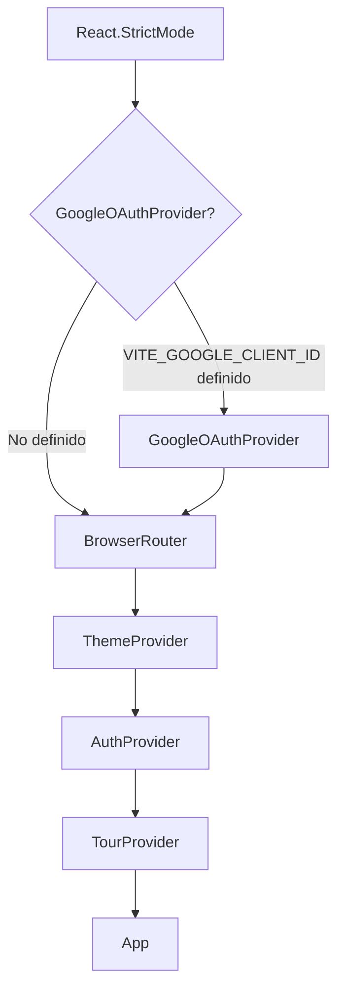
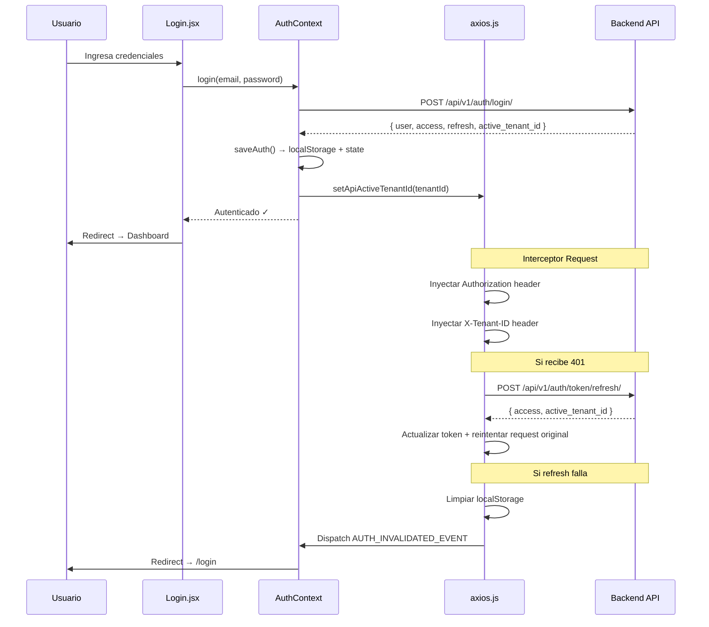
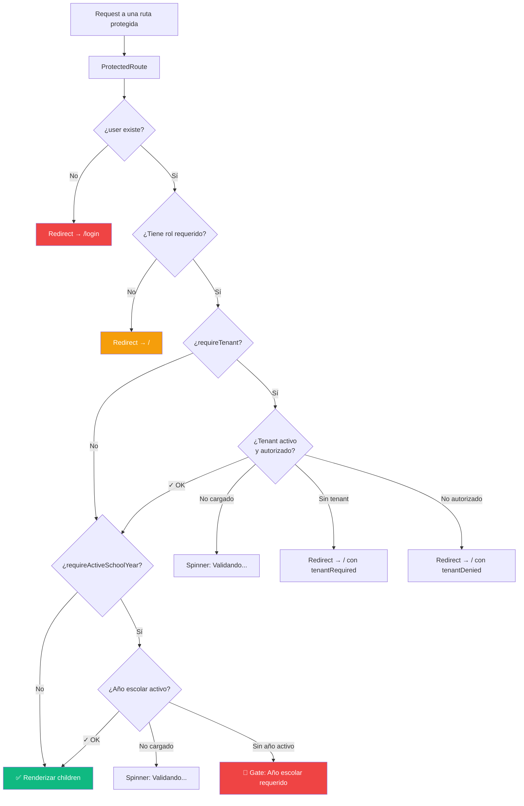
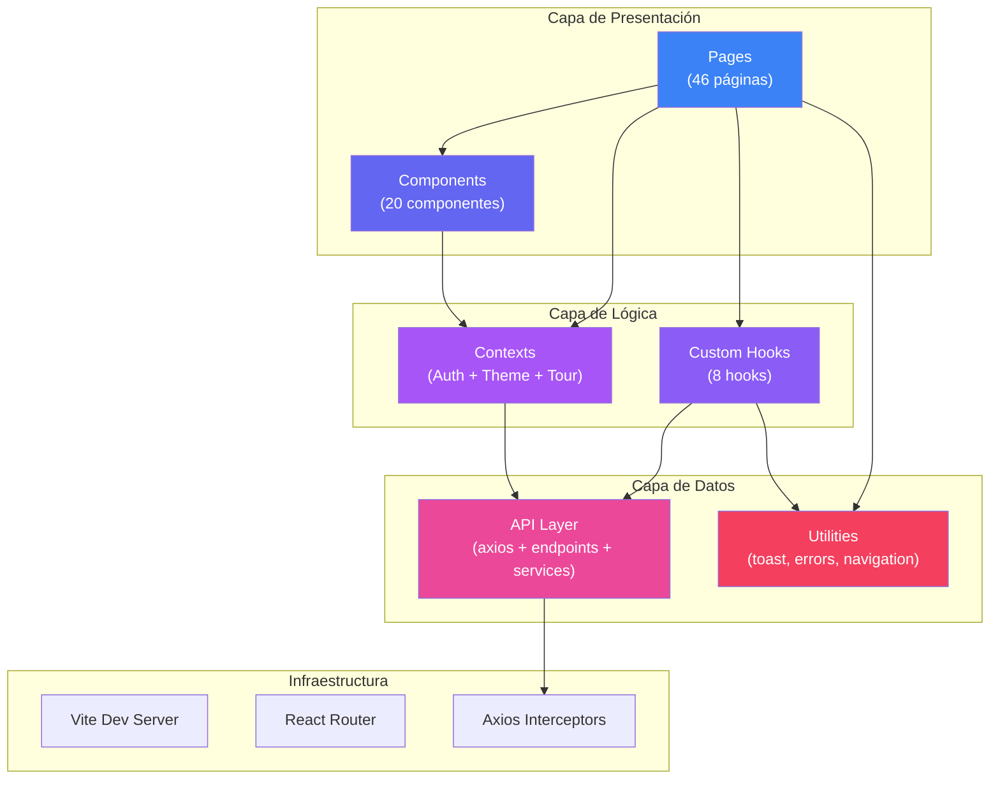
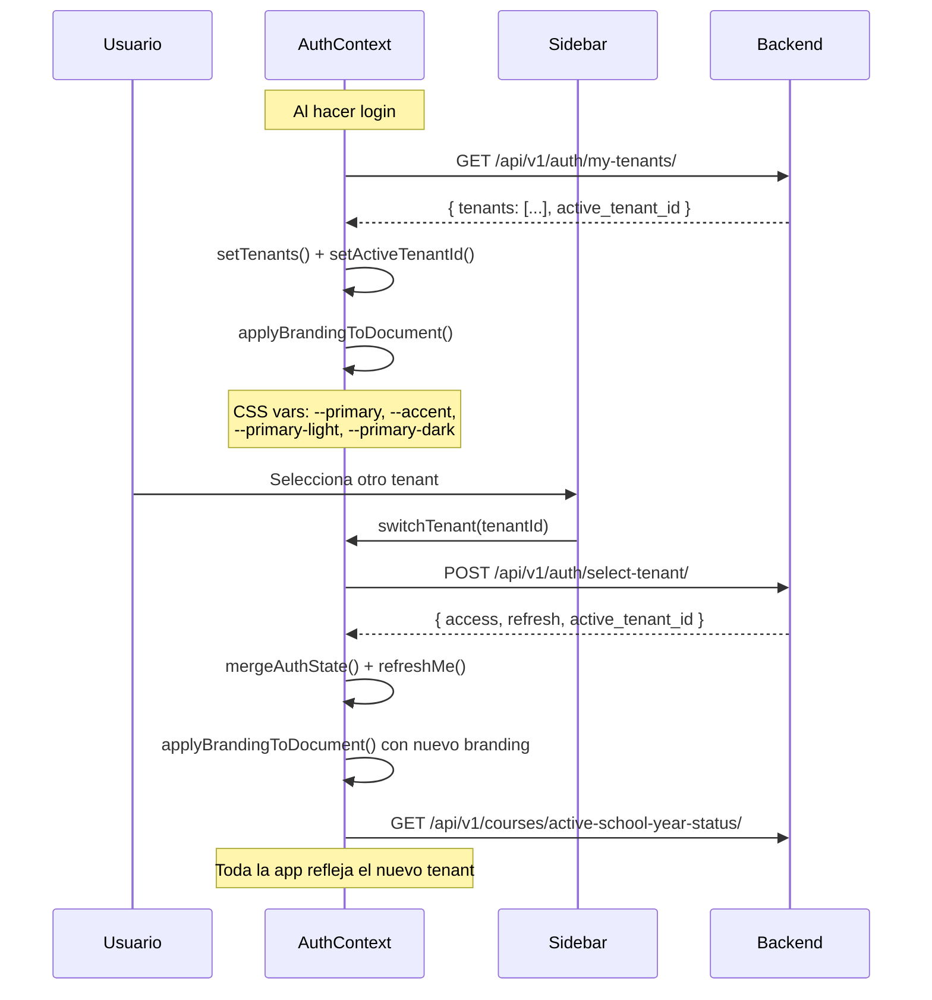
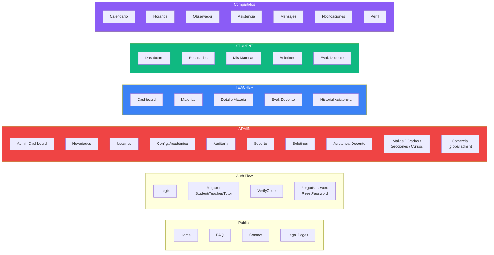
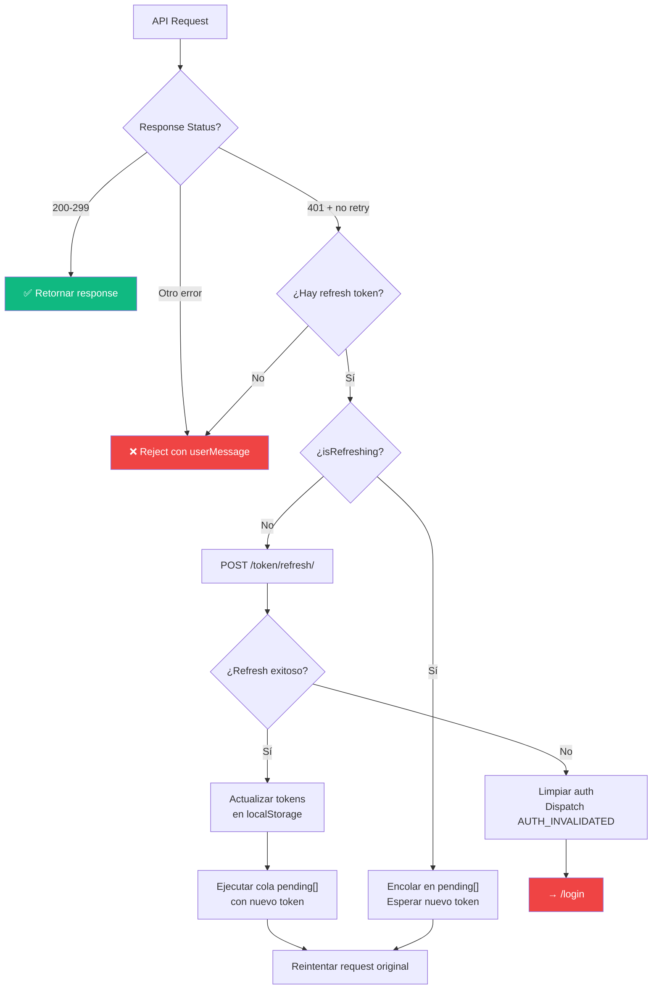

# 📊 Diagramas de Arquitectura

## 1. Árbol de Providers (Bootstrap)

El orden de los providers en `main.jsx` es crítico — cada provider depende del anterior:



> **¿Por qué este orden?** `ThemeProvider` es independiente. `AuthProvider` necesita el router para `api.js`. `TourProvider` necesita `AuthContext` para filtrar módulos por rol.

---

## 2. Flujo de Autenticación Completo



---

## 3. Sistema de Routing y Guards



---

## 4. Arquitectura de Componentes (Vista de Capas)



---

## 5. Flujo Multi-Tenant



---

## 6. Mapa de Módulos de Página por Rol



---

## 7. Flujo de Token Refresh (Interceptor)

```mermaid
statechart-v2
```



---

## 8. Layout Visual de la App

```
┌─────────────────────────────────────────────────────┐
│  [☰]  (Mobile hamburger — solo visible en mobile)   │
├────────────┬────────────────────────────────────────┤
│            │  [Skip Link → #main-content]           │
│            │                                        │
│  SIDEBAR   │  ContextualTipBanner                   │
│            │  ┌──────────────────────────────────┐  │
│  • Brand   │  │                                  │  │
│  • Nav     │  │     <Routes>                     │  │
│    sections│  │     (Lazy-loaded pages)           │  │
│  ─────────│  │                                  │  │
│  • 🔔     │  │     Wrapped in:                   │  │
│  • 👤     │  │     - ErrorBoundary               │  │
│  • 🚪     │  │     - Suspense                    │  │
│            │  │                                  │  │
│            │  └──────────────────────────────────┘  │
├────────────┴────────────────────────────────────────┤
│  AppTour (Suspense, lazy — overlay cuando activo)   │
└─────────────────────────────────────────────────────┘
```

- El **Sidebar** se oculta cuando `user === null` (páginas públicas y auth)
- En mobile, el Sidebar es un drawer con overlay
- En desktop, el Sidebar se puede colapsar (estado persistido en localStorage)
