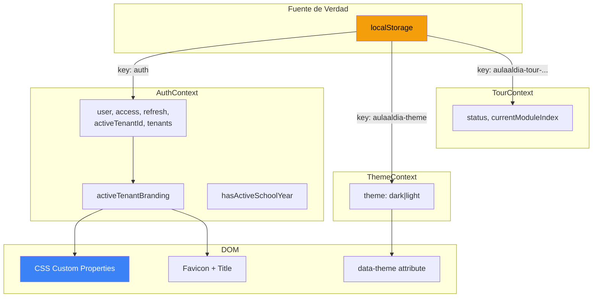

# 🧠 Estado Global y Contextos

El estado global del frontend se gestiona mediante tres React Contexts. No se usa ninguna librería de state management externa — el patrón `Context + useState + useEffect` cubre todas las necesidades actuales.

---

## Jerarquía de Providers

```
ThemeProvider          ← Dark/Light mode
  └─ AuthProvider      ← Tokens, user, tenants, branding
       └─ TourProvider ← Onboarding tour state
```

---

## 1. AuthContext (`src/state/AuthContext.jsx`)

El contexto más complejo y crítico del frontend. Gestiona:

### Estado Expuesto

| Campo | Tipo | Descripción |
|-------|------|-------------|
| `user` | `object \| null` | Datos del usuario autenticado |
| `access` | `string \| null` | JWT access token |
| `refresh` | `string \| null` | JWT refresh token |
| `isAuthenticated` | `boolean` | Computed: `!!user` |
| `lastLoginAt` | `string \| null` | Timestamp del último login |
| `lastLoginIp` | `string \| null` | IP del último login |
| `activeTenantId` | `string \| null` | ID del tenant activo |
| `activeTenant` | `object \| null` | Objeto completo del tenant activo |
| `activeTenantBranding` | `object` | Branding normalizado del tenant |
| `tenants` | `array` | Lista de tenants disponibles |
| `tenantsLoaded` | `boolean` | Si la lista de tenants terminó de cargar |
| `hasActiveSchoolYear` | `boolean \| null` | Si el tenant tiene año escolar activo |
| `activeSchoolYear` | `object \| null` | Datos del año escolar activo |
| `schoolYearGateLoaded` | `boolean` | Si el check de año escolar terminó |

### Acciones

| Método | Descripción |
|--------|-------------|
| `login(email, password)` | Login con credenciales → guarda tokens |
| `googleLogin(id_token)` | Login con Google → guarda tokens |
| `register(payload)` | Registro de nuevo usuario |
| `logout()` | Limpia todo el estado y localStorage |
| `updateUser(user)` | Actualiza datos del usuario en estado y storage |
| `updateActiveTenant(tenantId)` | Cambia el tenant activo localmente |
| `switchTenant(tenantId)` | Cambia tenant vía API (obtiene nuevos tokens) |
| `refreshMe()` | Refresca datos del usuario desde `/api/v1/auth/me/` |
| `fetchMyTenants()` | Recarga la lista de tenants |
| `fetchActiveSchoolYearStatus()` | Verifica si hay año escolar activo |

### Branding Dinámico

Cuando cambia el tenant activo, `AuthContext` aplica branding al DOM:

```javascript
// CSS custom properties actualizadas dinámicamente
--primary          → tenant.primaryColor
--primary-light    → lighten(primaryColor, 18%)
--primary-dark     → darken(primaryColor, 18%)
--accent           → tenant.accentColor
--text-accent      → primaryColor
--border-accent    → primaryColor
--overlay-bg       → rgba(primaryColor, 0.14)
--overlay-hover    → rgba(primaryColor, 0.22)
```

También actualiza `document.title` y el favicon.

### Persistencia

- Estado guardado en `localStorage` bajo la key `auth`
- Se rehidrata al montar el provider (primer `useEffect`)
- Sincronización cross-tab: si otra pestaña borra `auth` de localStorage, el usuario es deslogueado

### Inactivity Timeout

- Configurable por usuario: `user.session_timeout` minutos (default: 30)
- Escucha eventos: `mousedown`, `keydown`, `scroll`, `touchstart`, `click`
- Check cada 60 segundos; si se excede el timeout → `logout()`

### Uso

```jsx
import { useAuth } from '../state/AuthContext'

function MyComponent() {
  const { user, isAuthenticated, activeTenantBranding, logout } = useAuth()
  // ...
}
```

---

## 2. ThemeContext (`src/state/ThemeContext.jsx`)

Gestiona el tema visual (dark/light) de la aplicación.

### Estado Expuesto

| Campo | Tipo | Descripción |
|-------|------|-------------|
| `theme` | `'dark' \| 'light'` | Tema actual |
| `isDark` | `boolean` | Shortcut para `theme === 'dark'` |
| `isLight` | `boolean` | Shortcut para `theme === 'light'` |
| `toggleTheme` | `() => void` | Alterna entre dark y light |

### Comportamiento

- **Persistencia**: `localStorage` key `aulaaldia-theme` (default: `'dark'`)
- **Aplicación al DOM**:
  - `document.documentElement.setAttribute('data-theme', theme)` → para selectores CSS `[data-theme="dark"]`
  - `document.body.classList.add('dark-theme' | 'light-theme')` → para compatibilidad

### Uso

```jsx
import { useTheme } from '../state/ThemeContext'

function MyComponent() {
  const { isDark, toggleTheme } = useTheme()
  // ...
}
```

---

## 3. TourContext (`src/state/TourContext.jsx`)

Gestiona el tour onboarding que guía a nuevos usuarios por los módulos de la app.

### Estado Expuesto

| Campo | Tipo | Descripción |
|-------|------|-------------|
| `modules` | `array` | Lista de módulos del tour (filtrada por rol) |
| `currentModule` | `object \| null` | Módulo actual del tour |
| `currentModuleIndex` | `number` | Índice del módulo actual |
| `isActive` | `boolean` | Si el tour está activo |
| `isCompleted` | `boolean` | Si el tour se completó |
| `status` | `string` | `'idle' \| 'active' \| 'paused' \| 'completed'` |
| `storageKey` | `string \| null` | Key de localStorage para este usuario |

### Acciones

| Método | Descripción |
|--------|-------------|
| `startOrResumeTour()` | Inicia o reanuda el tour |
| `pauseTour()` | Pausa el tour |
| `restartTour()` | Reinicia desde el primer módulo |
| `completeCurrentModule()` | Avanza al siguiente módulo |

### Persistencia

- Key: `aulaaldia-tour-progress-v2-{ROLE}-{userId}`
- Cada usuario y rol tiene su propio progreso independiente
- Se guarda: `{ status, currentModuleIndex }`

### Relación con Navigation

Los módulos del tour se generan desde `getOnboardingNavigationItems()`, que filtra los items de navegación que tienen `tourId` y `onboarding` definidos.

---

## Diagrama de Flujo de Estado


